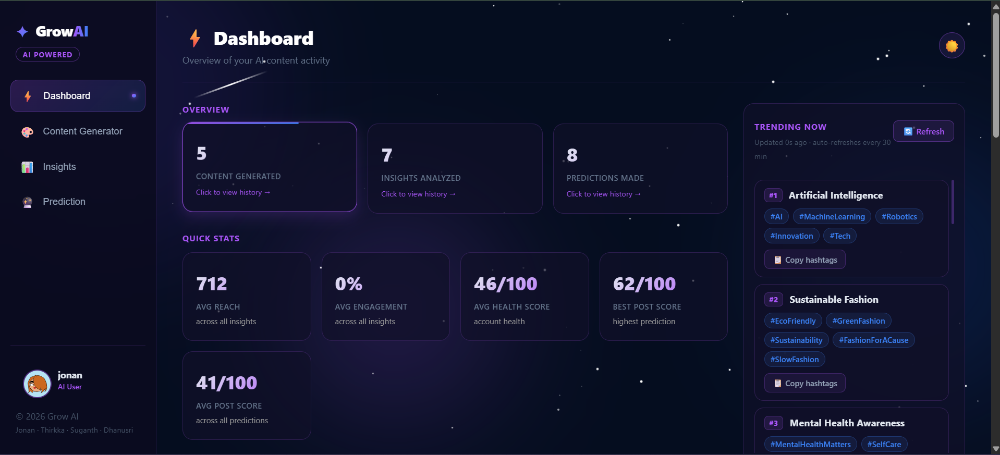
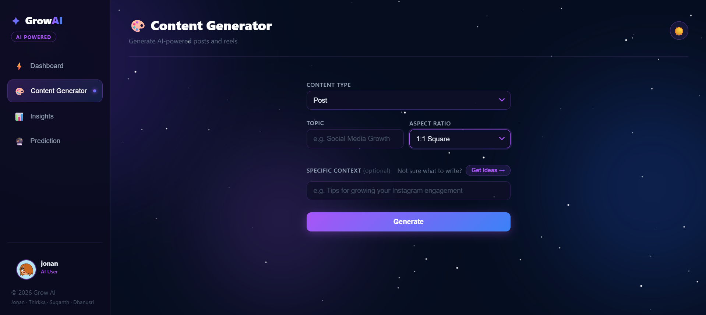
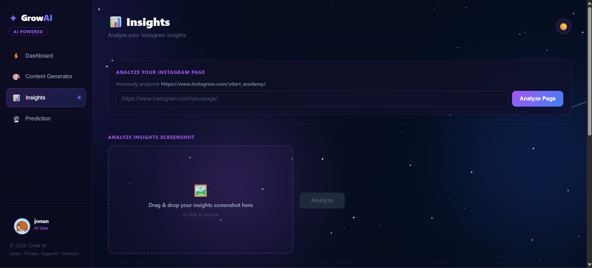
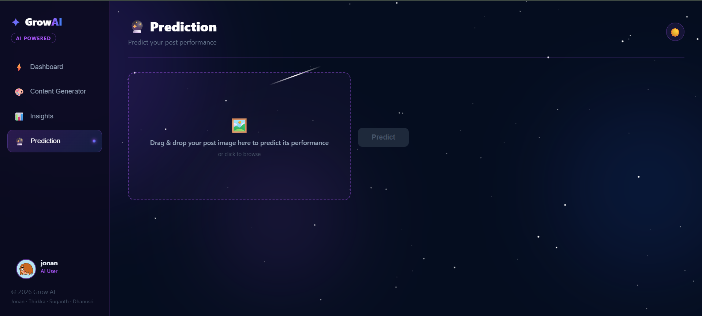

# Grow AI

An AI-powered Instagram content generation and analytics platform.

## Features

- AI-generated posts and reels (Groq + Gemini + Pexels)
- Instagram insights analyzer
- Post performance prediction
- Trending hashtags widget
- User onboarding and profile management

## Screenshots

### Dashboard


### Content Generator


### Insights Analyzer


### Post Predictor


## Tech Stack

- **Frontend:** React
- **Backend:** Django REST Framework
- **AI:** Groq (LLaMA), Google Gemini
- **Images:** Pexels API, Pollinations AI

---

## Setup Instructions

### 1. Clone the repository

```bash
git clone https://github.com/your-username/grow-ai.git
cd grow-ai
```

### 2. Set up API Keys

Copy the example env file and fill in your own keys:

```bash
cp .env.example .env
```

Then open `.env` and replace the placeholders with your actual keys:

| Variable | Where to get it |
|---|---|
| `DJANGO_SECRET_KEY` | Generate one at [djecrety.ir](https://djecrety.ir) |
| `GEMINI_API_KEY` | [Google AI Studio](https://aistudio.google.com/app/apikey) |
| `GROQ_API_KEY` | [Groq Console](https://console.groq.com/keys) |
| `PEXELS_API_KEY` | [Pexels API](https://www.pexels.com/api/) |
| `GROQ_API_KEY_1` to `GROQ_API_KEY_5` | Multiple keys from [Groq Console](https://console.groq.com/keys) for rotation |

### 3. Install Python dependencies

```bash
pip install -r requirements.txt
```

### 4. Run Django backend

```bash
cd backend-new
python manage.py migrate
python manage.py runserver
```

### 5. Run React frontend

```bash
cd instagrow-frontend
npm install
npm start
```

The app will be available at `http://localhost:3000`

---

## Notes

- Never commit your `.env` file — it is already in `.gitignore`
- You can use a single Groq key for all `GROQ_API_KEY_1` through `GROQ_API_KEY_5` if you don't have multiple
